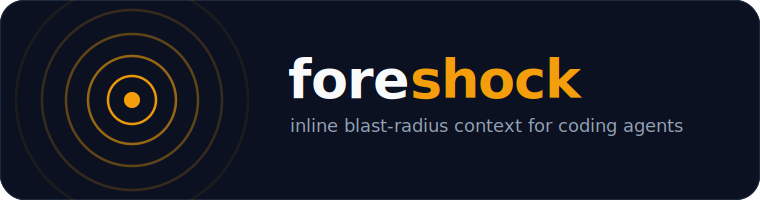
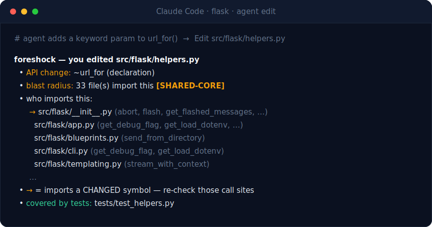

<p align="center">
  
</p>

<p align="center">
  <em>Peripheral vision for coding agents — the tremor before the break.</em>
</p>

<p align="center">
  <a href="LICENSE"></a>
  
  
  
  
</p>

---

**In one line:** foreshock is a tiny local hook that, the moment an AI coding agent edits a file,
tells it what *else* that change affects — *who depends on it, which tests cover it, what the compiler
won't catch* — so the agent fixes the ripple before it moves on.

When a coding agent edits a file, it thinks *locally* — one function, one signature — and then moves
on, blind to what it just put at risk. **foreshock gives it peripheral vision.**

**A concrete example.** An agent renames a function, updates the one call site it can see, and
continues — not realizing that function is imported by 14 other files, three of which now break. A
human catches it a day later in review. foreshock catches it *in the same breath as the edit*: the
instant the agent touches that function it sees *"blast radius: 14 files `[SHARED-CORE]`, here are the
3 that import the changed symbol, here's the test that covers it."* So it fixes all of it now — or,
with deep mode on, sees the **actual compiler errors the change would cause before it even applies.**

It rides **inside** the agent loop (Claude Code / Cursor / Codex) as a hook that fires **before** an
edit (a preview — *"this change would…"*) and **after** it (a confirm). Not a linter, not a dashboard,
not a post-commit PR report — a context layer the agent consumes *before the bug exists.* It's
**local and dependency-free** (pure Python stdlib, no network), and it stays **silent** on edits that
don't matter, so it's signal, not noise.

<p align="center">
  
</p>

<p align="center">
  <sub>Live capture — an agent adds a parameter to Flask's <code>url_for</code>; foreshock catches that a
  local-looking edit is a <code>SHARED-CORE</code> hub change across 33 files and hands back the test to run.</sub>
</p>

> foreshock works the same on string-literal unions and enums. Add `"sha224"` to zod's
> `HashAlgorithm` and it points at the two `hash()` dispatch sites that compile clean but throw at
> runtime — the lookup is a `keyof typeof` cast `tsc` can't check. ([more real examples →](docs/EXAMPLES.md))

## Why

Every other tool in this space looks at the diff **after** it's written — PR review, a dashboard, a
report. By then the agent has already moved three steps on. foreshock's bet is that the useful moment
is **during** the edit: tell the agent its change is bigger than it looks, *while it can still act on
it.* Proactive, in-loop, single purpose.

## What you get — the packet

For each edit, the engine emits a **diff-aware, symbol-level** packet describing the *consequences* of
the change, not a raw file count. A packet reads like this:

```text
foreshock — you edited src/auth/session.ts
  • API change: ~validateToken (declaration)
  • blast radius: 11 file(s) import this [SHARED-CORE]
  • who imports this:
      → src/api/middleware.ts (validateToken)
      → src/api/login.ts (validateToken)
        src/util/jwt.ts (decode)
      … (+6 more)
  • → = imports a CHANGED symbol — re-check those call sites
  • covered by tests: src/auth/session.test.ts
```

Line by line:

- **What changed about the public surface** — `API change: +foo` / `~bar (declaration)` vs
  `content-only: changed the body of X, import contract intact`. (Reconstructed from the edit's
  before/after strings.)
- **Who imports this** — every dependent annotated with the symbols it pulls, with **`→`** marking the
  ones that import a *changed* symbol. Kills the "49 files but only 2 are affected" noise.
- **Covered by tests** — the test files that exercise the edited module.
- **Variant / completeness** — *"you added `bar` to the `Foo` set — handle the new case at ⟨dispatch
  sites the compiler won't flag⟩"* (TS string unions, Python `Enum`/`Literal`, Java/C# `enum`, Go typed
  `const`/`iota`).

The "who imports this" list is **ranked** — importers of a *changed* symbol (`→`) come first, so the
ones that matter survive the cap. And critically, it stays **silent** on local, zero-dependent,
non-API edits. Signal, not noise.

## Preview, deep simulation & frameworks

- **Preview before you touch it.** On `PreToolUse`, foreshock projects the edit from the proposed
  change and shows what it *would* do — *"preview: this change would… API change: +sum; −add; blast
  radius: 33 [SHARED-CORE]"* — so the agent can adjust before anything is written.
- **Deep simulation (opt-in).** Set `FORESHOCK_DEEP=1` and the preview runs the project's **real**
  checker on an isolated copy and reports only the diagnostics the change *introduces* — e.g.
  `src/calc.ts(1,10): error TS2305: Module './math' has no exported member 'add'.` — before the edit
  lands. Your files are never touched. (tsc · py_compile/mypy · javac · go build · ruby -c.)
- **Framework edges.** Adapters recover coupling the import graph can't see — the Django adapter links
  `ForeignKey("app.Model")` string references that have no `import`. (Next.js / Rails to come.)

Details in [docs/USAGE.md](docs/USAGE.md).

## Quickstart

```bash
git clone https://github.com/bitey30/foreshock && cd foreshock
./engine/install.sh        # installs into ~/.claude/hooks + registers the Pre (preview) & Post (confirm) hooks
```

Restart Claude Code and edit a file that others import — the packet appears in the agent's next turn.
The hook **self-roots** to each edited file's repo, so one global install works across every project.

> Re-run `./engine/install.sh` after changing anything in `engine/` — the global copy doesn't
> auto-update, and a stale copy gives weaker packets.

Run it by hand, too:

```bash
python3 engine/impact_engine.py                  # repo map: blast-radius hot spots
python3 engine/impact_engine.py --file src/x.ts  # context packet for one file
```

**Full setup, packet anatomy, and troubleshooting → [docs/USAGE.md](docs/USAGE.md)**

## How it works

A **language-agnostic core + one plugin per language.** `impact_engine.py` owns the import graph,
blast-radius, and the packet; each `lang_*.py` owns its language's imports, resolution, exports, and
variant types. **Adding a language is one file.**

| | |
|---|---|
| `impact_engine.py` | graph · transitive dependents · diff reconstruction · the packet |
| `lang_ts.py` | TS/JS — `import`/`export … from`, barrels, dynamic `import()`, `require()`, ts/jsconfig path aliases, string-literal unions |
| `lang_python.py` | Python — absolute + relative imports, `sys.path` resolution, `def`/`class`/const exports, `Enum` + `Literal[…]` |
| `lang_java.py` | Java — package→FQCN resolution (`import a.b.C;`, static, wildcard), public type/method exports, `enum` |
| `lang_go.py` | Go — package-as-directory imports (`module/sub` → all files in that package), Capitalised exports, typed `const`/`iota` variant groups |
| `lang_ruby.py` | Ruby — `require_relative`/`require`, class/module/`def` surface (no enums) |
| `lang_csharp.py` | C# — `using` namespace imports (a namespace spans many files), public type/method exports, `enum` variants |
| `framework_django.py` | Django adapter — recovers string-FK model coupling (`ForeignKey("app.Model")`) the import graph can't see |
| `impact_hook.py` | the `PreToolUse` (preview) + `PostToolUse` (confirm) hook — pipes the tool payload to the engine and injects the packet |

**Local-only, like a library.** Pure Python standard library — no dependencies, no API keys, no
account, no network. It runs as a local subprocess, reads one repo, prints a packet back into your own
agent's context. Nothing is collected, nothing leaves your machine, works fully offline.

## Honest scope

foreshock reads **import-shaped** coupling. It's strong where imports *are* the coupling
(libraries, SDKs, shared modules) and weak where coupling is conventional or runtime (e.g. Next.js app
routes wired by file convention). **Framework adapters** (Django today) begin to recover that
app-coupling, but it's early. Parsing is regex-based, not a full compiler front-end, so exotic
re-exports / reflection / dynamic dispatch can slip by — and per-language symbol granularity varies
(Ruby/C# resolve at file/namespace level, so they show *who* depends without the per-symbol `→`).
It's a **context layer, not a guarantee** — a prompt to look, not proof you've found everything. The
honest write-up of where it fails (and why it's a library tool, not an app tool) lives in
[`experiments/bugcatch-deviation/`](experiments/bugcatch-deviation/).

## License

[MIT](LICENSE).
